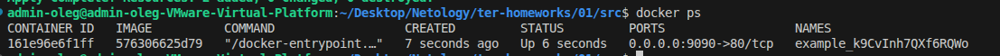

Задание 1
------------------------------------------------------------------------------------------------------------------------------------------------
    1.3. "result": "k9CvInh7QXf6RQWo"
    1.4. Раскомментируйте блок кода, примерно расположенный на строчках 29–42 файла **main.tf**.
            Выполните команду ```terraform validate```. Объясните, в чём заключаются намеренно допущенные ошибки. Исправьте их.
            - В документации указано, что должно быть обязательнго имя ресурса (добавил имя nginx)
            - A name must start with a letter or underscore and may contain only letters, digits, underscores, and dashes. - нельзя начинать с цифр
            - A managed resource "random_password" "random_string_FAKE" has not been declared in the root module. - нет такой зависимотси, есть random_string
            - This object has no argument, nested block, or exported attribute named "resulT". Did you mean "result"? - нет такой параметра, есть random_password.random_string.result
    1.5. 
    1.6. Замените имя docker-контейнера в блоке кода на ```hello_world```. Не перепутайте имя контейнера и имя образа. Мы всё ещё продолжаем 
            использовать name = "nginx:latest". Выполните команду ```terraform apply -auto-approve```.
            Объясните своими словами, в чём может быть опасность применения ключа  ```-auto-approve```. Догадайтесь или нагуглите зачем может пригодиться данный ключ? В качестве ответа дополнительно приложите вывод команды ```docker ps```.
            - -auto-approve - ключ, который пропускает ручной ввод аппрува, опасен тем, что можем не проверив внести изменения в конфигурацию,которая может являться важной (в данном примере удалился контейнер nginx, так как в  конфиге main.tf больше нет такого ресурса)
    1.7. {
            "version": 4,
            "terraform_version": "1.12.2",
            "serial": 22,
            "lineage": "3f5c08ec-1cf0-b3c2-6df0-70ca3e31ac43",
            "outputs": {},
            "resources": [],
            "check_results": null
        }
    1.8.- keep_locally = true 
          keep_locally (Boolean) If true, then the Docker image won't be deleted on destroy operation. If this is false, it will delete the image from the docker local storage on destroy operation.
------------------------------------------------------------------------------------------------------------------------------------------------

Задание 2
------------------------------------------------------------------------------------------------------------------------------------------------
https://github.com/olegmanzhay/ter-homeworks/blob/main/01/02/main.tf
------------------------------------------------------------------------------------------------------------------------------------------------
Задание 3
------------------------------------------------------------------------------------------------------------------------------------------------
Перенастроил .terraformrc для работы и со всеми регистри
------------------------------------------------------------------------------------------------------------------------------------------------

provider_installation {
  network_mirror {
    url = "https://terraform-mirror.yandexcloud.net/"
    include = ["*/*"]  # Включаем ВСЕ провайдеры
  }
  direct {
    exclude = ["*/*"]  # Исключаем ВСЁ, отдавая приоритет нашему зеркалу
  }
}
------------------------------------------------------------------------------------------------------------------------------------------------