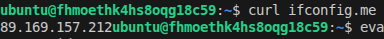

Задание 1
------------------------------------------------------------------------------------------------------------------------------------------------
Блок 4
    - прописал cloud_id/folder_id в default чтобы не вводить значения постоянно при запуске 
    - "standart-v4" not found - не найден, заменил на v3 (Intel Ice Lake)
    - InvalidArgument desc = the specified core fraction is not available on platform "standard-v3"; allowed core fractions: 20, 50, 100 ->  (core_fraction = 20)
    - InvalidArgument desc = the specified number of cores is not available on platform "standard-v3"; allowed core number: 2, 4 -> (cores = 2)
------------------------------------------------------------------------------------------------------------------------------------------------
Блок 5
    - curl ifconfig.me -> 89.169.157.212
    - eval $(ssh-agent) && ssh-add -> Agent pid 963
------------------------------------------------------------------------------------------------------------------------------------------------
Блок 6
    - preemptible = true - прерываемая ВМ, через 24 часа стопается -> экономия денег
    - core_fraction=5 - процент использования ядра, если есть соседи ->  используем меньше, платим меньше
------------------------------------------------------------------------------------------------------------------------------------------------
скриншот ЛК Yandex Cloud с созданной ВМ, где видно внешний ip-адрес;

------------------------------------------------------------------------------------------------------------------------------------------------
скриншот консоли, curl должен отобразить тот же внешний ip-адрес;

------------------------------------------------------------------------------------------------------------------------------------------------

Задание 2
------------------------------------------------------------------------------------------------------------------------------------------------
После интерполяции получен ответ от terraform apply
No changes. Your infrastructure matches the configuration.

Terraform has compared your real infrastructure against your configuration and found no differences, so no changes are needed.
------------------------------------------------------------------------------------------------------------------------------------------------

Задание 4
------------------------------------------------------------------------------------------------------------------------------------------------
```
Outputs:

result = [
  {
    "web" = <<-EOT
    VM_name: netology-develop-platform-web
    FQDN: netology-develop-platform-web
    public_ip: 178.154.223.77
    
    EOT
  },
  {
    "db" = <<-EOT
    VM_name: netology-develop-platform-db
    FQDN: netology-develop-platform-db
     public_ip: 158.160.92.95
    
    EOT
  },
]
result_db = {
  "FQDN" = "netology-develop-platform-db"
  "VM_name" = "netology-develop-platform-db"
  "public_ip" = "158.160.92.95"
}
result_web = {
  "FQDN" = "netology-develop-platform-web"
  "VM_name" = "netology-develop-platform-web"
  "public_ip" = "178.154.223.77"
}

```
------------------------------------------------------------------------------------------------------------------------------------------------

Задание 5
------------------------------------------------------------------------------------------------------------------------------------------------
```
locals {
  db_name = "${var.vm_db_name}-${var.vm_web_platform_id}"
}
```
------------------------------------------------------------------------------------------------------------------------------------------------

Задание 6
------------------------------------------------------------------------------------------------------------------------------------------------
Перевел код на работу с объектами
Ссылки
------------------------------------------------------------------------------------------------------------------------------------------------

Задание 7
------------------------------------------------------------------------------------------------------------------------------------------------
> local.test_list.1
"staging"

> length(local.test_list)
3

> local.test_map.admin
"John"

> format("%s is %s for %s server based on OS %s with %s vcpu, %s ram and %s virtual disks", local.test_map.admin, keys(local.test_map)[0], keys(local.servers)[1], local.servers[keys(local.servers)[1]].image, local.servers[keys(local.servers)[1]].cpu ,local.servers[keys(local.servers)[1]].ram, join(", ", local.servers[keys(local.servers)[1]].disks))

"John is admin for production server based on OS ubuntu-20-04 with 10 vcpu, 40 ram and vda, vdb, vdc, vdd virtual disks"
------------------------------------------------------------------------------------------------------------------------------------------------

Задание 8
------------------------------------------------------------------------------------------------------------------------------------------------
var.test.dev1[0]
"ssh -o 'StrictHostKeyChecking=no' ubuntu@62.84.124.117"
------------------------------------------------------------------------------------------------------------------------------------------------

Задание 9
------------------------------------------------------------------------------------------------------------------------------------------------