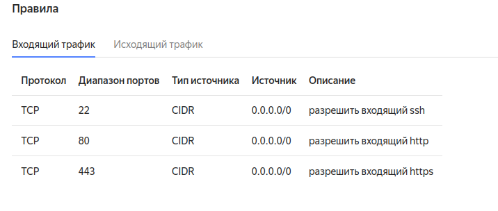
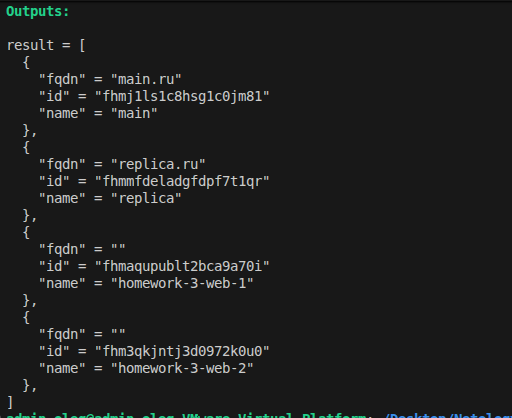

Задание 1
------------------------------------------------------------------------------------------------------------------------------------------------


Задание 2
------------------------------------------------------------------------------------------------------------------------------------------------
Проверка работоспособности security_groups
Поставил на 1 тачку Nginx 
```
curl -v http://localhost:80
*   Trying 127.0.0.1:80...
* Connected to localhost (127.0.0.1) port 80 (#0)
> GET / HTTP/1.1
> Host: localhost
> User-Agent: curl/7.81.0
> Accept: */*
> 
* Mark bundle as not supporting multiuse
< HTTP/1.1 200 OK
```

Потом прокинул со 2 тачки запрос 
```
ubuntu@fhmtmar35sp44u5gg2me:~$ curl -v http://10.0.1.11:80/
*   Trying 10.0.1.11:80...
* Connected to 10.0.1.11 (10.0.1.11) port 80 (#0)
> GET / HTTP/1.1
> Host: 10.0.1.11
> User-Agent: curl/7.81.0
> Accept: */*
> 
* Mark bundle as not supporting multiuse
< HTTP/1.1 200 OK
< Server: nginx/1.18.0 (Ubuntu)
```

Потом на 1 тачке поменял порт с 80 на 81, который слушает Nginx и проверил что с 81 порта отдается 
```
curl -v http://localhost:81
*   Trying 127.0.0.1:81...
* Connected to localhost (127.0.0.1) port 81 (#0)
> GET / HTTP/1.1
> Host: localhost:81
> User-Agent: curl/7.81.0
> Accept: */*
> 
* Mark bundle as not supporting multiuse
< HTTP/1.1 200 OK
< Server: nginx/1.18.0 (Ubuntu)
```

Потом проверил со 2 тачки доступ по порту 81 и получил 
```
curl -v http://10.0.1.11:81/
*   Trying 10.0.1.11:81...
* connect to 10.0.1.11 port 81 failed: Connection timed out
* Failed to connect to 10.0.1.11 port 81 after 130779 ms: Connection timed out
* Closing connection 0
curl: (28) Failed to connect to 10.0.1.11 port 81 after 130779 ms: Connection timed out
```

Вывод: VM находятся в зоне безопасности и входящий трафик по http может быть принято только по порту 80

Задание 3 - 5
------------------------------------------------------------------------------------------------------------------------------------------------
https://github.com/olegmanzhay/ter-homeworks/blob/terraform-03/03/src/disk_vm.tf  



Задание 7
------------------------------------------------------------------------------------------------------------------------------------------------
  

Задание 8
------------------------------------------------------------------------------------------------------------------------------------------------
platform_id=${i["platform_id "]}} - лишний пробел + скобка }

Задание 9
------------------------------------------------------------------------------------------------------------------------------------------------

