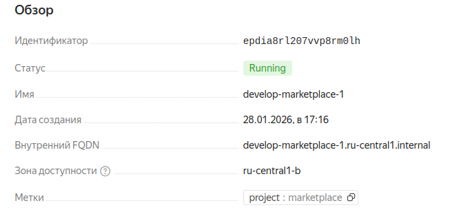
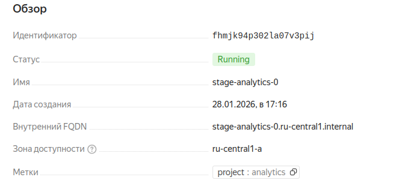
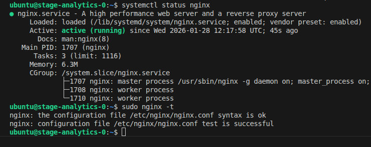
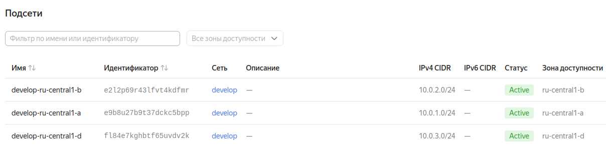
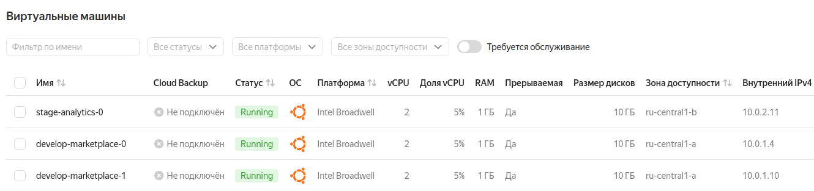

Задание 1
----------------------------------------------------------------------------------------------------------------------------------
  
  
  
```
> module.marketplace-vm
{
  "external_ip_address" = [
    "178.154.225.187",
    "178.154.192.40",
  ]
  "fqdn" = [
    "develop-marketplace-0.ru-central1.internal",
    "develop-marketplace-1.ru-central1.internal",
  ]
  "internal_ip_address" = [
    "10.0.1.21",
    "10.0.2.33",
  ]
  "labels" = [
    tomap({
      "project" = "marketplace"
    }),
    tomap({
      "project" = "marketplace"
    }),
  ]
  "network_interface" = [
    tolist([
      {
        "dns_record" = tolist([])
        "index" = 0
        "ip_address" = "10.0.1.21"
        "ipv4" = true
        "ipv6" = false
        "ipv6_address" = ""
        "ipv6_dns_record" = tolist([])
        "mac_address" = "d0:0d:10:b6:68:71"
        "nat" = true
        "nat_dns_record" = tolist([])
        "nat_ip_address" = "178.154.225.187"
        "nat_ip_version" = "IPV4"
        "security_group_ids" = toset(null) /* of string */
        "subnet_id" = "e9be4ia1uoqdvfrl9k0d"
      },
    ]),
    tolist([
      {
        "dns_record" = tolist([])
        "index" = 0
        "ip_address" = "10.0.2.33"
        "ipv4" = true
        "ipv6" = false
        "ipv6_address" = ""
        "ipv6_dns_record" = tolist([])
        "mac_address" = "d0:0d:12:52:37:51"
        "nat" = true
        "nat_dns_record" = tolist([])
        "nat_ip_address" = "178.154.192.40"
        "nat_ip_version" = "IPV4"
        "security_group_ids" = toset(null) /* of string */
        "subnet_id" = "e2lrd07nee6coq4vconp"
      },
    ]),
  ]
}
```

Задание 2
----------------------------------------------------------------------------------------------------------------------------------
https://github.com/olegmanzhay/ter-homeworks/commit/1731c5ae45efd4142fb00d21acd6ff57f2918062

Задание 3
----------------------------------------------------------------------------------------------------------------------------------
```
terraform state list

data.template_file.cloudinit
module.analytics-vm.data.yandex_compute_image.my_image
module.analytics-vm.yandex_compute_instance.vm[0]
module.marketplace-vm.data.yandex_compute_image.my_image
module.marketplace-vm.yandex_compute_instance.vm[0]
module.marketplace-vm.yandex_compute_instance.vm[1]
module.network.yandex_vpc_network.network
module.network.yandex_vpc_subnet.subnet

terraform state rm module.network.yandex_vpc_network.network
terraform state rm module.network.yandex_vpc_subnet.subnet

terraform state rm module.marketplace-vm.yandex_compute_instance.vm[1]
terraform state rm module.marketplace-vm.yandex_compute_instance.vm[0]
terraform state rm module.analytics-vm.yandex_compute_instance.vm[0]

terraform import module.network.yandex_vpc_network.network enpvcoi1ub69jubag192
terraform import module.network.yandex_vpc_subnet.subnet e9bpvkje0j44cgt8fpdj
terraform import module.analytics-vm.yandex_compute_instance.vm[0] fhm2ag1fugbo92fd6jbm
terraform import module.marketplace-vm.yandex_compute_instance.vm[0] fhm5ltetorff4cb90j3m
terraform import module.marketplace-vm.yandex_compute_instance.vm[1] fhmv8oeldrq9kipot2g7

admin-oleg@admin-oleg-VMware-Virtual-Platform:~/Desktop/Netology/ter-homeworks/04/src/vms$ terraform plan
data.template_file.cloudinit: Reading...
data.template_file.cloudinit: Read complete after 0s [id=e8f312a38b6ec326680486dba5f0299d916a2d264bf1c7d6801ddb0ecc00d438]
module.network.yandex_vpc_network.network: Refreshing state... [id=enpvcoi1ub69jubag192]
module.analytics-vm.data.yandex_compute_image.my_image: Reading...
module.marketplace-vm.data.yandex_compute_image.my_image: Reading...
module.analytics-vm.data.yandex_compute_image.my_image: Read complete after 0s [id=fd8hisvjobe0bl7q527m]
module.marketplace-vm.data.yandex_compute_image.my_image: Read complete after 0s [id=fd8hisvjobe0bl7q527m]
module.network.yandex_vpc_subnet.subnet: Refreshing state... [id=e9bpvkje0j44cgt8fpdj]
module.marketplace-vm.yandex_compute_instance.vm[0]: Refreshing state... [id=fhm5ltetorff4cb90j3m]
module.analytics-vm.yandex_compute_instance.vm[0]: Refreshing state... [id=fhm2ag1fugbo92fd6jbm]
module.marketplace-vm.yandex_compute_instance.vm[1]: Refreshing state... [id=fhmv8oeldrq9kipot2g7]

Terraform used the selected providers to generate the following execution plan. Resource actions are indicated with the following symbols:
  ~ update in-place

Terraform will perform the following actions:

  # module.analytics-vm.yandex_compute_instance.vm[0] will be updated in-place
  ~ resource "yandex_compute_instance" "vm" {
      + allow_stopping_for_update = true
        id                        = "fhm2ag1fugbo92fd6jbm"
        name                      = "stage-analytics-0"
        # (15 unchanged attributes hidden)

        # (6 unchanged blocks hidden)
    }

  # module.marketplace-vm.yandex_compute_instance.vm[0] will be updated in-place
  ~ resource "yandex_compute_instance" "vm" {
      + allow_stopping_for_update = true
        id                        = "fhm5ltetorff4cb90j3m"
        name                      = "develop-marketplace-0"
        # (15 unchanged attributes hidden)

        # (6 unchanged blocks hidden)
    }

  # module.marketplace-vm.yandex_compute_instance.vm[1] will be updated in-place
  ~ resource "yandex_compute_instance" "vm" {
      + allow_stopping_for_update = true
        id                        = "fhmv8oeldrq9kipot2g7"
        name                      = "develop-marketplace-1"
        # (15 unchanged attributes hidden)

        # (6 unchanged blocks hidden)
    }

Plan: 0 to add, 3 to change, 0 to destroy.

```

Задание 4
----------------------------------------------------------------------------------------------------------------------------------
https://github.com/olegmanzhay/ter-homeworks/commit/5233e3c119e63fffa06bfdc479a02745f8f46f45
  
  

