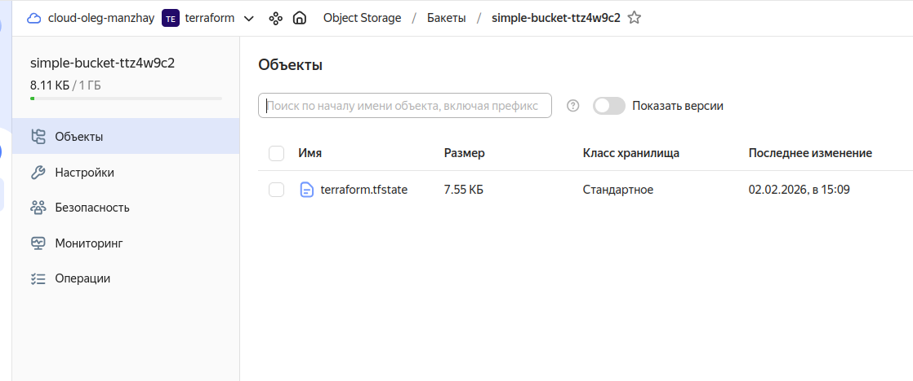

Задание 1
-------------------------------------------------------------------------------------------------------------------------------------------

```
Непройденные проверки (ошибки) без дублей:

    CKV_YC_2: «"Ensure compute instance does not have public IP."».
    Не пройдена для ресурсов:
        module.analytics-vm.yandex_compute_instance.vm;
        module.marketplace-vm.yandex_compute_instance.vm;
        module.example-vm.yandex_compute_instance.vm
        Причина: экземпляры имеют публичные IP-адреса (public_ip = true в конфигурации).
    CKV_YC_11: «Ensure security group is assigned to network interface.».
        module.analytics-vm.yandex_compute_instance.vm;
        module.marketplace-vm.yandex_compute_instance.vm;
        module.example-vm.yandex_compute_instance.vm
    Причина: сетевые интерфейсы не привязаны к группам безопасности.
    CKV_TF_1: «Ensure Terraform module sources use a commit hash».
    Не пройдена для модулей:
        marketplace-vm (/vms/main.tf:13–34);
        analytics-vm (/vms/main.tf:36–56).
        test-vm
        example-vm
        Причина: в source модулей указана только версия (ref=1.0.0), но не хэш коммита

```

Задание 2
-------------------------------------------------------------------------------------------------------------------------------------------
Миграция tfstate - S3

```
admin-oleg@admin-oleg-VMware-Virtual-Platform:~/Desktop/Netology/ter-homeworks/04/s3$ terraform init
Initializing the backend...
Do you want to copy existing state to the new backend?
  Pre-existing state was found while migrating the previous "local" backend to the
  newly configured "s3" backend. No existing state was found in the newly
  configured "s3" backend. Do you want to copy this state to the new "s3"
  backend? Enter "yes" to copy and "no" to start with an empty state.

  Enter a value: yes

```
  


Снятие блокировки  
```
  admin-oleg@admin-oleg-VMware-Virtual-Platform:~/Desktop/Netology/ter-homeworks/04/s3$ terraform apply
╷
│ Error: Error acquiring the state lock
│ 
│ Error message: operation error S3: PutObject, https response error StatusCode: 412, RequestID: 0286ab831a4d1b89, HostID: , api error
│ PreconditionFailed: At least one of the pre-conditions you specified did not hold
│ Lock Info:
│   ID:        78c6a8a1-8e7a-05c8-0c84-599d0dee0312
│   Path:      simple-bucket-ttz4w9c2/terraform.tfstate
│   Operation: OperationTypeInvalid
│   Who:       admin-oleg@admin-oleg-VMware-Virtual-Platform
│   Version:   1.12.2
│   Created:   2026-02-02 10:30:02.199609757 +0000 UTC
│   Info:      
│ 
│ 
│ Terraform acquires a state lock to protect the state from being written
│ by multiple users at the same time. Please resolve the issue above and try
│ again. For most commands, you can disable locking with the "-lock=false"
│ flag, but this is not recommended.


admin-oleg@admin-oleg-VMware-Virtual-Platform:~/Desktop/Netology/ter-homeworks/04/s3$ terraform force-unlock 78c6a8a1-8e7a-05c8-0c84-599d0dee0312
Do you really want to force-unlock?
  Terraform will remove the lock on the remote state.
  This will allow local Terraform commands to modify this state, even though it
  may still be in use. Only 'yes' will be accepted to confirm.

  Enter a value: yes

Terraform state has been successfully unlocked!

The state has been unlocked, and Terraform commands should now be able to
obtain a new lock on the remote state.
```


Задание 3
-------------------------------------------------------------------------------------------------------------------------------------------
Результат работы Checkov
```
Check: CKV_SECRET_6: "Base64 High Entropy String"
        FAILED for resource: 3f18cbc16519d859e11e7bef7451f9ed5b6a7c4b
        File: /main.tf:35-36

                35 |     user_password           = "te**********"
```

Ушел из хардкода кредов в vault (PR)
https://github.com/olegmanzhay/ter-homeworks/pull/1

Задание 4
-------------------------------------------------------------------------------------------------------------------------------------------

```
terraform console
> var.ip_address
"192.168.0.1"

terraform console
╷
│ Error: Invalid value for variable
│ 
│   on variables.tf line 1:
│    1: variable "ip_address" {
│     ├────────────────
│     │ var.ip_address is "192.1608.0.1"
│ 
│ Значение должно быть корректным IPv4‑адресом (например, 192.168.0.1).
│ 
│ This was checked by the validation rule at variables.tf:7,3-13.


admin-oleg@admin-oleg-VMware-Virtual-Platform:~/Desktop/Netology/ter-homeworks/05$ terraform console
> var.ip_list
tolist([
  "192.168.0.1",
  "1.1.1.1",
  "127.0.0.1",
])
> ^C
admin-oleg@admin-oleg-VMware-Virtual-Platform:~/Desktop/Netology/ter-homeworks/05$ terraform console
╷
│ Error: Invalid value for variable
│ 
│   on variables.tf line 13:
│   13: variable "ip_list" {
│     ├────────────────
│     │ var.ip_list is list of string with 3 elements
│ 
│ Все элементы списка должны быть корректными IPv4‑адресами.
│ 
│ This was checked by the validation rule at variables.tf:18,3-13.
╵

╷
│ Warning: Due to the problems above, some expressions may produce unexpected results.
```
