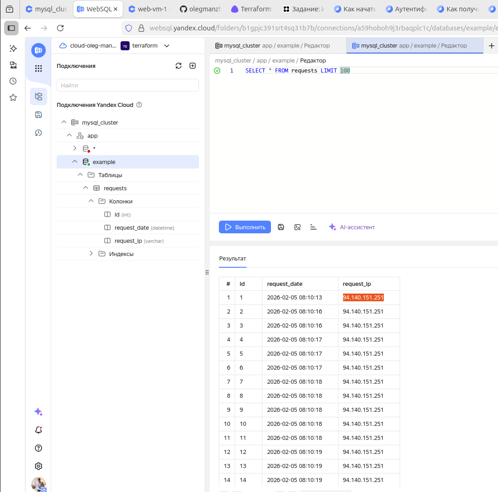

Задание 1. 
---------------------------------------------------------------------------------------------------------------------------------------------------


module vpc: https://github.com/olegmanzhay/ter-homeworks/tree/terraform-05/project/modules  
module vms: https://github.com/olegmanzhay/ter-homeworks/tree/terraform-05/project/modules/vms  
module container_registry: https://github.com/olegmanzhay/ter-homeworks/tree/terraform-05/project/modules/registry  
module mysql: https://github.com/olegmanzhay/ter-homeworks/tree/terraform-05/project/modules/mysql

Вызов модулей и создание инфры: https://github.com/olegmanzhay/ter-homeworks/blob/terraform-05/project/modules/vms/example/main.tf

Задание 2. 
---------------------------------------------------------------------------------------------------------------------------------------------------
Используя user-data (cloud-init), установите Docker и Docker Compose (см. Задания 5 модуля «Виртуализация и контейнеризация»).  
https://github.com/olegmanzhay/ter-homeworks/blob/terraform-05/project/modules/vms/example/cloud-init.yml

Задание 3. 
---------------------------------------------------------------------------------------------------------------------------------------------------
Опишите Docker файл (см. Задания 5 «Виртуализация и контейнеризация») c web-приложением и сохраните контейнер в Container Registry.
Взял готовый образ из ДЗ по докеру https://github.com/olegmanzhay/Netology/tree/master/shvirtd-example-python  


Задание 4.
---------------------------------------------------------------------------------------------------------------------------------------------------

Завяжите работу приложения в контейнере на БД в Yandex Cloud.   

**Прериквизиты**     
ip VM: 93.77.180.112  
ip DB: rc1a-3i8ofgkbtphk5qfd.mdb.yandexcloud.net  

**Результат**  

```
admin-oleg@admin-oleg-VMware-Virtual-Platform:~/Desktop/Netology/ter-homeworks/project/modules/vms/example$ curl -v http://93.77.180.112:8090/
*   Trying 93.77.180.112:8090...
* Connected to 93.77.180.112 (93.77.180.112) port 8090
> GET / HTTP/1.1
> Host: 93.77.180.112:8090
> User-Agent: curl/8.5.0
> Accept: */*
> 
< HTTP/1.1 200 OK
< Server: nginx/1.29.4
< Date: Thu, 05 Feb 2026 08:10:22 GMT
< Content-Type: application/json
< Content-Length: 47
< Connection: keep-alive
< 
* Connection #0 to host 93.77.180.112 left intact
"TIME: 2026-02-05 08:10:22, IP: 94.140.151.251"
```



**Документация по работе**  

https://yandex.cloud/ru/docs/cli/quickstart#install
https://yandex.cloud/ru/docs/container-registry/operations/docker-image/docker-image-pull
https://yandex.cloud/ru/docs/terraform/resources/container_registry

-------------------------------------------------------------------------
**Выполненные этапы**

-------------------------------------------------------------------------
Для загрузки образов в контейнер регистри
crp7h6sd8aeq2d7fbugb
```
docker tag nginx cr.yandex/crp7h6sd8aeq2d7fbugb/nginx:latest
docker tag haproxy cr.yandex/crp7h6sd8aeq2d7fbugb/haproxy:2.4
docker tag web cr.yandex/crp7h6sd8aeq2d7fbugb/web:1.0.0

docker push cr.yandex/crp7h6sd8aeq2d7fbugb/nginx:latest
docker push cr.yandex/crp7h6sd8aeq2d7fbugb/haproxy:2.4
docker push cr.yandex/crp7h6sd8aeq2d7fbugb/web:1.0.0
```
-------------------------------------------------------------------------

Установка yc
```
curl -sSL https://storage.yandexcloud.net/yandexcloud-yc/install.sh | bash
exec -l $SHELL
yc init
yc config list


echo <token>|docker login \
  --username oauth \
  --password-stdin \
 cr.yandex
```
-------------------------------------------------------------------------

Скачать образы на ВМ из контейнер регистри
```
yc container image list
docker pull cr.yandex/crp7h6sd8aeq2d7fbugb/web:1.0.0
docker pull cr.yandex/crp7h6sd8aeq2d7fbugb/nginx:latest
docker pull cr.yandex/crp7h6sd8aeq2d7fbugb/haproxy:2.4
```
-------------------------------------------------------------------------
Подключиться к БД
```
mkdir -p ~/.mysql && \
wget "https://storage.yandexcloud.net/cloud-certs/CA.pem" \
   --output-document ~/.mysql/root.crt && \
chmod 0600 ~/.mysql/root.crt

sudo apt update && sudo apt install --yes mysql-client

mysql --host=rc1a-3i8ofgkbtphk5qfd.mdb.yandexcloud.net \
      --port=3306 \
      --ssl-ca=~/.mysql/root.crt \
      --ssl-mode=VERIFY_IDENTITY \
      --user=app \
      --password= \
      example

В БД выдал гранты, при этом сначала выдал пользавателю app права админа БД (может быть дальше и не нужно было выдавать гранты)
GRANT ALL PRIVILEGES ON example.* TO 'app'@'%';
FLUSH PRIVILEGES;
```

Выполнил корректировку env, для прокидывания fqdn DB  
Выполнил curl со своей локальной машины до хоста тачки в клауде 

-------------------------------------------------------------------------